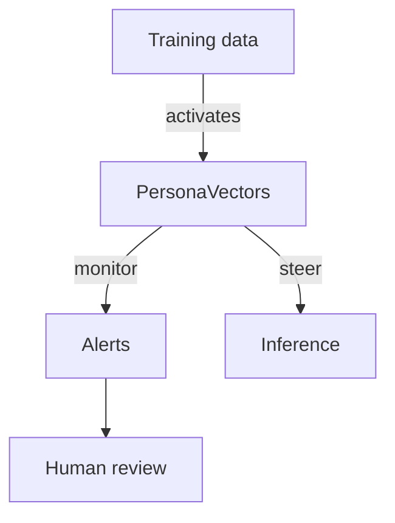

Anthropic's "persona vectors" paper explains how to find and control personality traits in language models. If you've seen a chatbot suddenly turn unhelpful or sarcastic, this research shows what's happening inside the model—and how to fix it.

**So what?** You can monitor when a model's tone shifts and steer it back without retraining. This makes model behavior more predictable and controllable.

### What are persona vectors?

A persona vector is a direction in the model's internal representation that corresponds to a trait like "helpful," "sarcastic," or "hallucinatory." The researchers found these directions by comparing how the model's hidden states differ when a trait appears versus when it doesn't. Once you find the direction, you can push or pull along it to change how the model behaves—no retraining needed.


<span aria-hidden="true" style="font-size:14px;color:#475569;">Steps: collect contrast pairs → capture hidden states → train linear probes → export vectors for monitoring and steering.</span>

Here's a simplified version of the idea:

```python
def measure_activation(model, prompt, probe_vector):
    hidden = model.get_hidden_states(prompt)
    return float(hidden @ probe_vector)

def steer_reply(model, prompt, persona_vec, strength=-0.4):
    score = measure_activation(model, prompt, persona_vec)
    adjusted = prompt + f"\n(Tone adjustment: {score + strength:.2f})"
    return model.generate(adjusted)
```

### Why it matters

* **Monitoring:** Track persona activations during conversations to catch when the model's tone shifts. You see problems before users do.
* **Steering:** If a trait spikes, dampen it by adjusting the vector. Correct behavior without changing the prompt or retraining.
* **Data cleanup:** Flag training samples that activate unwanted traits, so you can remove them before the next training run.
* **Traceability:** Since vectors live in activation space, you can log their values alongside responses. Interventions become auditable.



### What this means for practitioners

Persona vectors are a practical tool for model safety. They don't eliminate risk—nothing does—but they give you visibility and control. If your chatbot starts behaving strangely, you can see which trait spiked and turn it down.

**So what?** Instead of guessing why a model misbehaves, you can measure and adjust. That's a meaningful step toward predictable AI.
