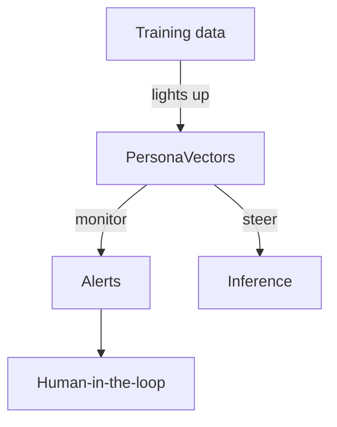

Anthropic's "persona vectors" paper is the rare research drop that reads like both a detective story and a tuner’s manual. If you have ever watched a chatbot suddenly act like a Saturday-morning cartoon villain, this work explains the neural switches behind those mood swings and how to dial them back before the sequel goes straight to streaming.

### What are persona vectors?

Think of a persona vector as a dimmer switch in the model's internal activations. Nudge one way and the model gets more "helpful"; nudge another and it slides into "sassy" or "hallucinatory." The researchers built an automated pipeline to find these switches by comparing the model's activations when a trait shows up versus when it doesn't. They measured the contrasts using linear probes on hidden states, then verified that adding or subtracting the discovered directions reliably altered tone without re-training the model.


A simplified sketch of the idea:

```python
def measure_activation(model, prompt, probe_vector):
    hidden = model.get_hidden_states(prompt)
    return float(hidden @ probe_vector)  # tiny cosine karaoke

def steer_reply(model, prompt, persona_vec, strength=-0.4):
    score = measure_activation(model, prompt, persona_vec)
    adjusted = prompt + f"\n(Tone knob at {score + strength:.2f})"
    return model.generate(adjusted)
```

### Why does it matter?

* **Monitoring:** Track persona activations during a conversation to catch when the vibe drifts from "helpful neighbor" to "supervillain origin story." Think of it as a baby monitor for your LLM.
* **Mitigation:** If a trait spikes, you can steer away from it by damping the corresponding vector. It's the ML version of turning down the treble when the song gets screechy.
* **Data flagging:** Samples that light up unwanted vectors can be tagged for cleanup before they get baked into the next model release.
* **Auditable knobs:** Because the vectors live in activation space, you can log their magnitudes alongside responses. That makes the intervention traceable instead of a mysterious prompt tweak.



### The road ahead

Persona vectors feel like a practical bridge between interpretability and safety. They make it possible to catch weird behavior early without pretending the model is a black-box oracle. The research doesn’t eliminate risk; there's no silver bullet, just better flashlights, and it does give practitioners new knobs to keep the conversation on the rails. And if the chatbot ever insists it's the main character, you'll know which dial to turn down.
