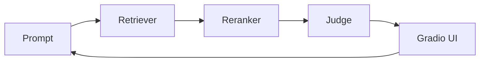

I recently released [`qareen`](https://github.com/zaffnet/qareen), a framework designed to balance relevance and diversity in few-shot examples. It extends Maximum Marginal Relevance (MMR) to multimodal tasks, helping LLM-as-a-Judge workflows avoid position bias and redundancy.

But the most interesting part of building `qareen` wasn't just the algorithm itself; it was *how* I built it. I teamed up with a swarm of coding agents (imagine a hackathon with a planner, a critic, and a UI tinkerer trading riffs) and the workflow reshaped my day-to-day work.


I leaned on a simple blend before Maximum Marginal Relevance: weight text and image scores (alpha hovered around 0.6 for most runs), normalize, then let MMR penalize near-duplicates. The diagram walks through a concrete blend from a sanity-check notebook run that consistently surfaced image-aware but text-relevant picks.

### From coder to conductor

Working with multiple agents shifted my role from writing every line of code to conducting the orchestra. I spent more time setting the tempo, defining boundaries, reviewing architecture, and making sure nobody soloed over the melody. The speed of iteration was wild: I could A/B test Weighted Linear Combination versus Reciprocal Rank Fusion (RRF) for blending text and image signals in the time it used to take me to refill my mug, and the agents wrote the first draft of the benchmarking harness before I finished the coffee.

Here's a tiny slice of what the agents and I iterated on for picking contrastive examples:

```python
from qareen.sampler import rr_rank, normalize_scores

def rerank_candidates(text_scores, image_scores, alpha=0.6):
    text = normalize_scores(text_scores)
    image = normalize_scores(image_scores)
    # Agents argued about alpha like it was a Spotify playlist order.
    return rr_rank(text, image, weight=alpha)
```

### The swarm playbook

A few lessons that felt less like sci-fi and more like solid engineering:

* **Context is king.** The agents were great at parallelizing tasks once the interfaces were crystal clear. Ambiguous tickets turned into improv comedy (funny, but not shippable).
* **Review over authoring.** My keyboard time dropped, but design reviews shot up. Catching subtle logic bugs and hallucinated imports became the main sport.
* **Visual feedback wins.** Spinning up a quick Gradio UI to tweak modality weights made it easy to see when a reranker was overconfident, which led to instant "this mix slaps" or "hard pass" decisions.
* **Reuse the logs.** Keeping transcripts of agent runs (commands plus outputs) made it possible to replay a good idea or diagnose when a tool change broke the chain. This mirrored the "replay buffer" pattern popular in existing agent frameworks.

To coordinate the swarm, I leaned on a simple ritual: short briefs, automated tests, and human taste checks at the end.



### Agentic design patterns that actually helped

I kept the playbook small so it stayed real and testable:

* **Planner and builders.** A planner agent broke tickets into subtasks, then task-focused agents delivered diffs. The pattern mirrors the planner-executor loop from AutoGPT-style systems but with tight scopes so nobody wandered.
* **Critic in the loop.** A critic agent ran linting and sanity checks, then I reviewed the PRs. It caught most missing imports before CI did.
* **Router for tools.** A lightweight router pointed agents to the right tool (vector store prep, evaluation harness, or UI tweak) so they did not hammer the same script for everything.
* **Replayable harness.** Every agent run wrote its commands and outputs into a log. Replaying the sequence made regressions easier to spot and removed debate about "what changed?".
* **Human taste check.** Even with good routing and critics, the final call on tradeoffs stayed human. It kept the reranker focused on clarity over cleverness.

### Takeaways for future builds

* **Agents are interns with superpowers.** They ship fast but still appreciate clear acceptance criteria (and fewer puns than this blog).
* **Keep a human-in-the-loop.** The model that suggests "just YOLO the alpha" needs an adult in the room.
* **Multimodality is worth the fuss.** Blending text and images reduced redundancy and surfaced delightfully weird-but-relevant examples.

`qareen` is open source and evolving. If you're curious about multimodal retrieval or just want to see how a small swarm can punch above its weight, give it a spin and tell me what worked, what broke, and what soundtrack you used while debugging.
