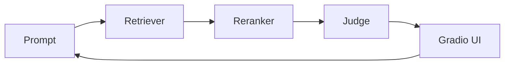

I recently released [`qareen`](https://github.com/zaffnet/qareen), a framework designed to balance relevance and diversity in few-shot examples. It extends Maximum Marginal Relevance (MMR) to multimodal tasks, helping LLM-as-a-Judge workflows avoid position bias and redundancy. 

But the most interesting part of building `qareen` wasn't just the algorithm itself; it was *how* I built it. I teamed up with a swarm of coding agents (picture a caffeinated Avengers line-up) to accelerate the process, and it completely reshaped my day-to-day work.


### From coder to conductor

Working with multiple agents shifted my role from writing every line of code to conducting the orchestra. I spent more time setting the tempo: defining boundaries, reviewing architecture, and making sure nobody soloed over the melody. The speed of iteration was wild: I could A/B test Weighted Linear Combination versus Reciprocal Rank Fusion (RRF) for blending text and image signals in the time it used to take me to refill my mug.

Here's a tiny slice of what the agents and I iterated on for picking contrastive examples:

```python
from qareen.sampler import rr_rank, normalize_scores

def rerank_candidates(text_scores, image_scores, alpha=0.6):
    text = normalize_scores(text_scores)
    image = normalize_scores(image_scores)
    # Agents argued about alpha like it was a Spotify playlist order.
    return rr_rank(text, image, weight=alpha)
```

### The swarm playbook

A few lessons that felt less like sci-fi and more like solid engineering:

* **Context is king.** The agents were great at parallelizing tasks once the interfaces were crystal clear. Ambiguous tickets turned into improv comedy (funny, but not shippable).
* **Review over authoring.** My keyboard time dropped, but design reviews shot up. Catching subtle logic bugs and hallucinated imports became the main sport.
* **Visual feedback wins.** Spinning up a quick Gradio UI to tweak modality weights made it easy to see when a reranker was overconfident. Instant "this mix slaps" or "hard pass" decisions.

To coordinate the swarm, I leaned on a simple ritual: short briefs, automated tests, and human taste checks at the end.



### Takeaways for future builds

* **Agents are interns with superpowers.** They ship fast but still appreciate clear acceptance criteria (and fewer puns than this blog).
* **Keep a human-in-the-loop.** The model that suggests "just YOLO the alpha" needs an adult in the room.
* **Multimodality is worth the fuss.** Blending text and images reduced redundancy and surfaced delightfully weird-but-relevant examples.

`qareen` is open source and evolving. If you're curious about multimodal retrieval, or just want to see how a small swarm can punch above its weight, give it a spin and tell me what worked, what broke, and what soundtrack you used while debugging.
