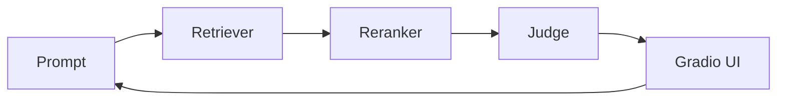

I recently released [`qareen`](https://github.com/zaffnet/qareen), a framework that picks better few-shot examples for LLM tasks. When you prompt a language model with examples, the quality of those examples matters. `qareen` finds examples that are relevant but not repetitive, mixing text and image signals to avoid the "same five examples every time" problem.

**So what?** If you use LLMs for evaluation or classification, better examples mean better results. `qareen` automates the selection so you don't have to hand-pick them.

But the most interesting part wasn't the algorithm—it was how I built it. I worked with multiple AI coding agents, each handling a different piece: one planned tasks, others wrote code, another ran tests. This changed how I work day-to-day.


<span aria-hidden="true" style="font-size:14px;color:#475569;">Work flows left to right: planner breaks tasks into tickets, builders and evaluator run in parallel, critic gates quality, human makes final calls.</span>


<span aria-hidden="true" style="font-size:14px;color:#475569;">The six patterns that actually worked: task planning, code critique, tool routing, run replay, visual feedback, and human review.</span>

### From writer to reviewer

Working with agents changed my role. Instead of writing every line, I spent more time reviewing, setting direction, and catching problems early. The speed surprised me: I could test different ranking approaches in the time it used to take to set up one experiment.

Here's a small piece of what the agents and I worked on for picking diverse examples:

```python
from qareen.sampler import rr_rank, normalize_scores

def rerank_candidates(text_scores, image_scores, alpha=0.6):
    text = normalize_scores(text_scores)
    image = normalize_scores(image_scores)
    # Blend text and image signals; alpha controls the mix.
    return rr_rank(text, image, weight=alpha)
```

**So what?** This pattern—agents drafting code while I focus on design—cut iteration time significantly and let me test more ideas.

### What worked

A few lessons from the build:

* **Clear instructions matter.** Agents work well when tasks are specific. Vague requests lead to guesswork.
* **Review more, write less.** My time shifted from typing to catching mistakes and guiding direction.
* **Visual tools help.** A quick UI for adjusting weights made it easy to spot when something was off.
* **Keep logs.** Recording what agents ran made it possible to reproduce good results or debug failures.

The workflow was straightforward: short briefs, automated tests, human review at the end.



### Patterns that helped

I kept the playbook simple:

* **Planner and builders.** One agent breaks work into small tasks; others execute them. Each task stays focused.
* **Critic in the loop.** A critic agent runs linting and tests before I review. It catches most obvious problems early.
* **Router for tools.** A simple router points agents to the right tool—vector store setup, evaluation runs, or UI changes—so they don't use the wrong one.
* **Replayable logs.** Every agent run writes its commands and outputs to a log. Replaying helps find what changed when something breaks.
* **Human final call.** Agents draft, but I make the final decision on trade-offs. This keeps the output practical, not just optimized for metrics.

### Takeaways

* **Agents speed things up, but need direction.** They work fast, but clear tasks and acceptance criteria matter.
* **Keep a human in the loop.** Someone needs to make judgment calls that agents can't.
* **Mixing text and images works.** Combining both signals reduced repetition and surfaced better examples.

**So what?** Multi-agent workflows aren't just a curiosity—they're a practical way to build faster while keeping quality high. The key is treating agents as collaborators, not replacements.

`qareen` is open source. If you're working on retrieval or few-shot prompting, give it a try and let me know what works.
